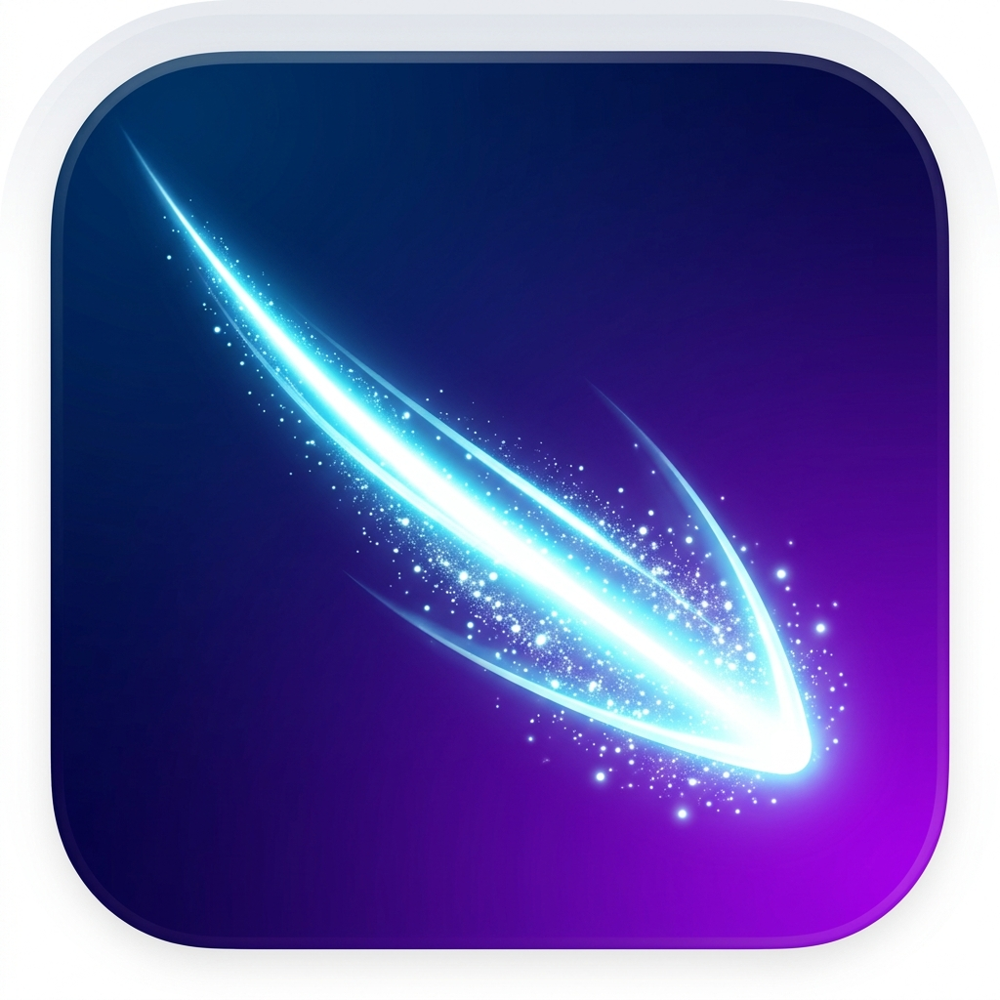

<div align="center">
  
  <h1>Delogo</h1>
  <p><strong>一款基于人工智能的高效、精准的批量去水印工具</strong></p>
</div>

---

Delogo 采用了现代化的前后端分离架构，前端使用 Vue 3 + Vite + Electron 构建开箱即用的桌面级原生体验，后端由 FastAPI 驱动，内置先进的深度学习图像修复引擎 (`iopaint` + `big-lama`)，无需联网即可在本地实现像素级的去水印魔法。

## 🌟 核心特性

- 🔮 **离线内嵌 AI 引擎**：安装包已将 `big-lama` 大模型物理熔铸在内部，**纯本地断网运行**，无惧隐私泄露，即开即用。
- 🎨 **极致纯净的画布体验**：支持拖拽导入单张或批量图片。
- 🎯 **自适应比例框选**：系统自动采用**相对百分比坐标系**，不管原图分辨率如何，只要水印在画面的相对位置一致（如右下角），只需在第一张图框选一次，即可完美适配所有同批次图片。
- ⚡️ **全自动批量处理流**：
  - 前端实时 WebSocket 推送处理进度与状态。
  - 完成后，提供沉浸式的 `Before & After` 丝滑对比滑块，拖拽即可见证惊艳效果。

## 📦 下载与安装

由于引入了全自动的 GitHub Actions 云端打包工厂，我们为 macOS 和 Windows 用户提供了开箱即用的安装包。

访问本仓库的 **[Releases 页面](../../releases)**，下载最新版本的 `.exe` (Windows) 或 `.dmg` (macOS) 直接安装运行即可，**无需配置任何 Python 或 Node.js 环境**！

## 🏗️ 架构说明

- **Frontend (前端)**
  - 技术栈：Vue 3 + TypeScript + Vite + TailwindCSS
  - 容器环境：Electron (支持原生本地文件读写与系统级对话框)
  - 通信机制：HTTP 提交任务 + WebSocket 获取进度推送
- **Backend (后端)**
  - 技术栈：Python 3.10+ + FastAPI + Uvicorn
  - 核心算法库：`iopaint` (LaMa 模型) + OpenCV (`cv2`) + PyTorch
  - 硬件加速支持：智能侦测当前硬件环境，自动开启 CPU / CUDA / Apple MPS 加速。

## 🚀 开发者指南

如果您希望在本地二次开发或自行打包代码，请遵循以下步骤。

### 1. 一键开发模式 (Dev Mode)

项目内置了一键启动脚本 `start_dev.sh` (仅限 Mac/Linux)：

```bash
chmod +x start_dev.sh
./start_dev.sh
```

- 脚本会自动为您创建 Python 虚拟环境，补齐缺少的依赖，并启动 FastAPI 后端。
- 随后会自动启动前端的 Vite 开发服务器与 Electron 热更新窗口。

### 2. 纯本地打包 (Local Build)

我们提供了一个强大的本地一键打包脚本：

```bash
python scripts/build.py
```

执行后，脚本会自动执行以下流程：
1. 使用 PyInstaller 将后端环境、FastAPI 和大模型熔铸为独立的可执行程序。
2. 使用 Electron-Builder 将前端页面和编译好的后端程序合并，生成操作系统的原生安装包 (`.dmg` 或 `.exe`)。
3. 最终产物会输出至 `frontend/release/` 目录下。

### 3. 云端工厂自动化打包 (GitHub Actions CI/CD)

对于**项目维护者**或**Fork 了本仓库的开发者**，您可以完全将繁重的打包工作交给 GitHub 的免费云端服务器：
1. 点击您仓库顶部的 **Actions** 标签。
2. 选择左侧的 **Build Delogo App**。
3. 点击右侧的 **Run workflow**：
   - 您可以选择目标操作系统（`windows-latest` / `macos-latest` / `both`）。
   - **(推荐)** 在 `Release Version` 框中填入版本号（如 `v1.0.0`），云端工厂会自动拉取依赖、内置 AI 模型、注入版本号进行打包，并最终将纯净的安装包自动发布至您仓库的 Releases 页面供全世界下载。

## 📅 ROADMAP

- [x] 跨平台安装包自动化 CI/CD 构建
- [x] 大模型本地化断网独立封装
- [ ] 复杂形状的高级多边形画笔选区
- [ ] 多水印同时去除支持
- [ ] 更高级的图像修补算法扩展 (如 Stable Diffusion 接入)

---
*Generated with 💻 and ☕ by the Delogo Team.*
